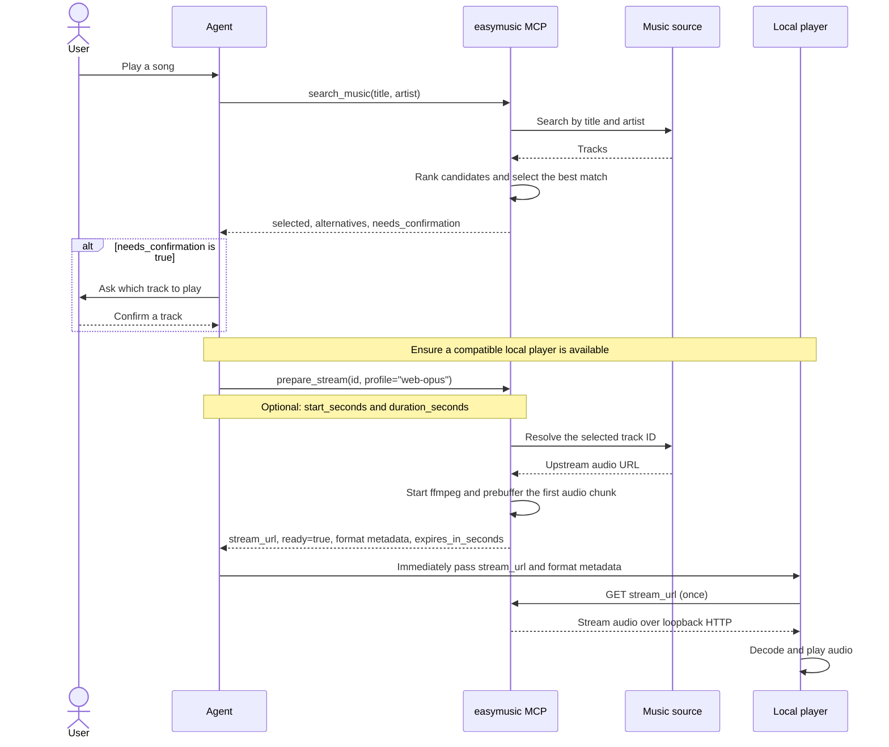

# easymusic

Agent-friendly music search and downloading CLI, plus an MCP server for search
and audio streaming. Music discovery and playable URL resolution go through a
pluggable **music source (音源)** layer: built-in `youtube` (yt-dlp), `netease`
(网易云音乐), and `kuwo` (酷我音乐) sources, plus external source plugins that
are ordinary executables in any language.

The metadata and audio paths remain separate:

- `search` queries one pinned source or falls back through sources in
  priority order, then ranks candidates locally and returns stable JSON.
- `download` searches and ranks by title/artist or accepts a namespaced ID/URL,
  then streams the original audio format directly to disk.
- `mcp` exposes search and one-time streaming preparation tools over stdio.

No browser, browser engine, page DOM parser, or Python installation is needed
when the standalone release binaries are used.

For agents, the [easymusic skill](skills/easymusic/SKILL.md) explains how to
choose between CLI and MCP, select tracks, download files, and consume one-time
audio streams. Its `skills/easymusic/` directory can be used with a host that
supports Agent Skills.

## Music sources (音源)

Every backend implements the `MusicSource` trait (`search` + `resolve`) and is
registered per client:

| Source | Search | Playback resolution | Track ID |
| --- | --- | --- | --- |
| `youtube` | `yt-dlp ytsearchN:` | `yt-dlp` bestaudio extraction | `youtube:<video id>` |
| `netease` | `music.163.com/api/search/get/web` | 128k outer link (`/song/media/outer/url`) redirect | `netease:<song id>` |
| `kuwo` | `search.kuwo.cn/r.s` | `antiserver.kuwo.cn/anti.s` convert_url3 (mp3, aac fallback) | `kuwo:<MUSIC_xxx>` |
| plugin | your executable | your executable | `<name>:<your id>` |

All public track IDs use `<source>:<native id>`, including YouTube
(`youtube:DYptgVvkVLQ`). IDs returned by `search` or `download` can be passed
unchanged to `download --id` / `prepare_stream`, regardless of source order.
Unprefixed input IDs are rejected. Source order controls search priority only.

```bash
# Pin one source for search/download
easymusic --source netease search --keyword "晴天 周杰伦" --pretty

# Without --source, sources are tried in priority order until one succeeds
# (useful when yt-dlp is unavailable or YouTube is challenged)
easymusic search --keyword "晴天 周杰伦"

# Merge and re-rank results across every enabled source
easymusic search --keyword "夜空中最亮的星" --all-sources --limit 10

# Restrict/reorder the enabled sources (search priority order)
easymusic --sources kuwo,netease search --keyword "晴天"
easymusic download --id "kuwo:MUSIC_51685512" --output-dir ./music
```

Equivalent environment variables are `EASYMUSIC_SOURCE` and
`EASYMUSIC_SOURCES`.

## Writing a source plugin

A plugin is any executable named `easymusic-source-<name>` placed in a plugin
directory: `plugins/` beside the easymusic executable, `--plugins-dir <PATH>` /
`EASYMUSIC_PLUGINS_DIR`, or directories listed in `EASYMUSIC_SOURCE_PATH`.
Built-in names are reserved. The protocol is plain JSON over stdin/stdout, so
it can be implemented in any language:

```jsonc
// stdin — request
{"protocol":"easymusic-source/1","operation":"search","source":"mysource","keyword":"晴天","limit":10}
{"protocol":"easymusic-source/1","operation":"resolve","source":"mysource","id":"<native id>"}

// stdout — response
{"ok":true,"tracks":[{"id":"t1","title":"晴天","artist":"周杰伦","artwork_url":"https://..."}]}
{"ok":true,"url":"https://cdn.example.com/a.mp3","title":"晴天","extension":"mp3"}
{"ok":false,"error":{"message":"why it failed"}}
```

Plugin track IDs are namespaced automatically; return your own native IDs and
pass them back unchanged (a plugin may also emit already-namespaced IDs, which
are recognised and left as-is). Resolved URLs must be HTTP(S). One request per
plugin invocation gets a 60-second deadline that covers feeding stdin, running
the process, and draining its output, so a plugin that ignores its input or
never exits cannot wedge a search or an MCP tool call; it fails over like any
other source error. A non-zero exit code or malformed JSON is reported the same
way.

A plugin's process tree is **request-scoped**: when the request ends — answer,
error, deadline, or the caller cancelling the tool call — everything the plugin
started is terminated, on every platform. Do not keep background processes
alive between requests. easymusic uses a process group on Unix (`setpgid`,
then `SIGKILL` to the group) and a Job Object with
`JOB_OBJECT_LIMIT_KILL_ON_JOB_CLOSE` on Windows; the latter is why cleanup does
not depend on the plugin leader still being alive to enumerate its children.
Windows plugins start suspended and resume only after job assignment succeeds,
so even immediately spawned helpers belong to the job. If containment setup
fails, the invocation reports an error instead of running without cleanup.
Example minimal plugin (Python):

```python
#!/usr/bin/env python3
# save as plugins/easymusic-source-demo and `chmod +x`
import json, sys
r = json.load(sys.stdin)
if r["operation"] == "search":
    json.dump({"ok": True, "tracks": [{"id": "d1", "title": "Demo", "artist": "easymusic"}]}, sys.stdout)
else:
    json.dump({"ok": True, "url": "https://example.com/demo.mp3", "extension": "mp3"}, sys.stdout)
```

Rust embedders can also implement `MusicSource` in-process and register it with
`SourceRegistry::from_sources` + `MusicClient::with_registry`.

## Library architecture

The CLI and MCP adapters share the same library workflows:

```text
CLI / MCP
    -> MusicClient: query validation, search strategy, ranking, selection
    -> SourceRegistry: source lookup and native/public ID conversion
    -> MusicSource: upstream search and URL resolution

ClientConfig -> provider::builder -> configured SourceRegistry
ExternalSource: JSON protocol -> process: byte exchange and process cleanup
Resolved URL -> download / streaming
```

`MusicQuery` keeps title and artist separate for ranking. `SearchStrategy`
chooses the first available source, pins one source, or merges a source list
(an empty merge list means all enabled sources). CLI flags and MCP parameters
are translated into these shared inputs.

Provider implementations return `Vec<SourceTrack>` and `SourceResolvedTrack`,
whose IDs are `NativeTrackId` values. The registry pairs each native ID with its
source using `TrackId`, then formats it for the existing JSON response. Source
implementations do not add prefixes. Native IDs containing colons remain opaque.
The external JSON adapter alone accepts the legacy already-prefixed plugin IDs.

For Rust source implementations migrating to this API, `search` now returns
`Result<Vec<SourceTrack>>`, and `resolve` accepts `&NativeTrackId` and returns
`Result<SourceResolvedTrack>`. `name()` borrows `&str`, so dynamically discovered
names need no leaked allocation. `source_diagnostics(name)` replaces the
YouTube-specific client getters and reads the active source's runtime details.
`SourceRegistry::search` routes to one named source; use `MusicClient` for
fallback, merged search, and selection. CLI/MCP JSON and the subprocess protocol
remain unchanged.

## Runtime layout

Official easymusic release archives include `yt-dlp` and a JavaScript runtime
(only the YouTube source and YouTube-specific extraction need them; `netease`
and `kuwo` work without any external binary):

```text
easymusic       # easymusic.exe on Windows
yt-dlp           # yt-dlp.exe on Windows
qjs              # qjs.exe on Windows; Deno is used on Windows ARM64
```

easymusic first looks for `yt-dlp` beside its own executable, then falls back
to `PATH`. When the selected `yt-dlp` has an adjacent `deno` or `qjs`, it is
automatically passed as the YouTube JavaScript runtime. Deno is preferred if
both exist.

This JavaScript runtime is required by current yt-dlp releases for full YouTube
support; it is a small command-line engine, not a browser. The official
standalone yt-dlp executable already contains its Python runtime and EJS solver
scripts.

When building or installing easymusic yourself, provide:

- Rust 1.88 or newer to build.
- `netease`/`kuwo` sources need no extra dependency.
- A current standalone `yt-dlp` executable for the `youtube` source.
- QuickJS-NG 0.12+ or Deno 2.3+ for current YouTube extraction.
- `ffmpeg` on `PATH` only for MCP audio output and the library streaming API.
  CLI search and download do not invoke ffmpeg.

Paths can be overridden without relying on machine-wide installations:

```bash
easymusic \
  --yt-dlp /opt/easymusic/yt-dlp \
  --js-runtime quickjs:/opt/easymusic/qjs \
  search --keyword "晴天" --artist "周杰伦" --pretty
```

Equivalent environment variables are `EASYMUSIC_YT_DLP` and
`EASYMUSIC_JS_RUNTIME`.

Some server/datacenter IPs are challenged by YouTube. Export a Netscape-format
`cookies.txt` on an authorized machine and mount it read-only on the server:

```bash
easymusic --cookies /run/secrets/youtube-cookies.txt \
  search --keyword "晴天" --artist "周杰伦"
```

`EASYMUSIC_YT_DLP_COOKIES` is the environment-variable equivalent. The server
does not need the browser that exported the file. Treat the file as a secret;
easymusic passes its path to yt-dlp and never includes its contents in output.

## Build

```bash
cargo build --release
cargo install --path .
```

`cargo install` installs only easymusic itself. For a self-contained server
deployment, use a release archive or place standalone yt-dlp and QuickJS/Deno
beside the installed easymusic executable.

## Searching

```bash
easymusic search --keyword "天地龙鳞" --artist "王力宏" --limit 10 --pretty
```

When both title and artist are supplied, easymusic searches for both (for
example `天地龙鳞 王力宏`) and then uses the separate values for local ranking.
Track IDs are source namespaced (`netease:186016`, `kuwo:MUSIC_51685512`, or
`youtube:DYptgVvkVLQ`). Download resolves the selected ID immediately before
transfer because resolved media URLs are short-lived.

The library API uses the same source registry:

```rust,no_run
use easymusic::{ClientConfig, MusicClient, MusicQuery, SearchStrategy, YtDlpConfig};
use std::path::PathBuf;

# async fn example() -> easymusic::Result<()> {
let client = MusicClient::with_config(ClientConfig {
    yt_dlp: YtDlpConfig {
        executable: PathBuf::from("/opt/easymusic/yt-dlp"),
        js_runtime: Some("quickjs:/opt/easymusic/qjs".to_owned()),
        cookies: Some(PathBuf::from("/run/secrets/youtube-cookies.txt")),
    },
    // None = every built-in and plugin source, in this priority order.
    sources: Some(vec!["netease".to_owned(), "kuwo".to_owned(), "youtube".to_owned()]),
    plugin_dirs: vec![PathBuf::from("/opt/easymusic/plugins")],
});
let query = MusicQuery::new(Some("晴天"), Some("周杰伦"))?;
let results = client.search_query(&query, &SearchStrategy::Pinned("netease".into()), 10).await?;
let audio = client.resolve(&results.tracks[0].id).await?;
# Ok(())
# }
```

## Downloading

Download the selected best audio-only format without transcoding:

```bash
# Uses the selected source's metadata to retain the format extension, such as .m4a or .webm
easymusic download --title "天地龙鳞" --artist "王力宏" --pretty

# Resolve a search-result ID (namespace decides the source), then save exactly
easymusic download --id "youtube:DYptgVvkVLQ" --output "./music/song.webm" --pretty
easymusic download --id "netease:186016" --output "./music/qingtian.mp3"

# A previously resolved URL can still be downloaded directly
easymusic download --url "https://example.com/song.mp3" --output-dir "./music"
```

Downloads use a temporary sibling file and are installed atomically after
completion. Existing files are preserved unless `--force` is supplied.

## Library streaming

Audio transcoding remains available to Rust integrations and the MCP server.

Available profiles:

| Profile | Output |
| --- | --- |
| `web-voice` | 48 kHz stereo Ogg Opus |
| `xiaozhi` | 24 kHz mono raw Opus packets with `len32be` framing |
| `pcm16k` | 16 kHz mono PCM s16le |
| `pcm24k` | 24 kHz mono PCM s16le |

The `len32be` format is a four-byte unsigned big-endian packet length followed
by one raw Opus packet, repeated until end-of-stream.

For an in-process device integration, consume chunks directly:

```rust,ignore
# async fn example(config: easymusic::StreamConfig) -> easymusic::Result<()> {
let mut audio = easymusic::spawn_audio_stream(&config).await?;
while let Some(chunk) = audio.next_chunk().await {
    // `opus-packets` yields one raw Opus packet per chunk.
    device.send_binary(chunk.data).await?;
}
audio.finish().await?;
# Ok(())
# }
```

## MCP server

```bash
easymusic mcp
```

The MCP server exposes:

- `search_music`: combine title/artist, search the music sources (the server's
  `--source` is the default and the optional `source` argument overrides it),
  rank candidates, and return the selected track plus alternatives.
- `prepare_stream`: resolve a confirmed namespaced ID, start ffmpeg, prebuffer
  the first audio chunk, and return a short-lived one-time loopback URL.

The agent prepares audio through MCP, then hands it to a compatible player.
`prepare_stream` does not itself start playback:



Pass the returned track ID unchanged. The player must be able to reach the MCP
server's loopback address. Do not probe or prefetch `stream_url` before playback;
that can consume it. If it expires or has already been consumed, call
`prepare_stream` again for the same selected track to obtain a fresh URL.

Streaming profiles are `xiaozhi-v1`, `web-opus`, `pcm-s16le-16k`, and
`pcm-s16le-24k`. Prepared streams are served only on loopback, expire after 60
seconds by default, can be consumed once, and are limited to eight pending
streams.

`EASYMUSIC_FFMPEG` overrides ffmpeg and `EASYMUSIC_STREAM_BIND` overrides the
MCP loopback listener. The corresponding CLI flags are also available.

## Diagnostics

```bash
easymusic doctor --pretty
easymusic doctor --online --pretty
```

The result reports the enabled `sources` list, the exact yt-dlp command,
detected adjacent JS runtime, ffmpeg version, and optionally the result of a
one-item online search per source. Each dependency also carries `required`, so
a `netease`/`kuwo`/plugin-only setup passes even without yt-dlp installed; the
executable stays a hard requirement only while the `youtube` source is enabled.

## Releases

Tags matching `v*` publish self-contained search/runtime archives for:

| Platform | Targets | Archive |
| --- | --- | --- |
| Linux (glibc) | `x86_64-unknown-linux-gnu`, `aarch64-unknown-linux-gnu` | `.tar.gz` |
| Linux (musl) | `x86_64-unknown-linux-musl`, `aarch64-unknown-linux-musl` | `.tar.gz` |
| macOS | `x86_64-apple-darwin`, `aarch64-apple-darwin` | `.tar.gz` |
| Windows | `x86_64-pc-windows-msvc`, `aarch64-pc-windows-msvc` | `.zip` |

Both Linux variants use a statically linked easymusic binary. The target suffix
selects the matching glibc or musl yt-dlp runtime bundled beside it.

Every archive includes easymusic, yt-dlp, QuickJS (or Deno on Windows ARM64),
documentation, third-party notices, and a SHA-256 checksum. ffmpeg remains a
separate optional runtime because it is used only by MCP and library
transcoding/streaming.

## Safety and usage

Only HTTP and HTTPS audio sources are accepted. Direct-URL downloads and
library streaming reject private, loopback, link-local, and documentation
addresses unless explicitly allowed by their flag or configuration.

`netease` outer links and `kuwo` play links are the same public endpoints used
by open-source music tools; VIP-only or removed tracks resolve to an error
instead of a playable URL. yt-dlp search and extraction depend on YouTube
behavior and may require regular yt-dlp updates. Use media only where you have
the right to access, download, and play it, and comply with the source site's
terms and applicable law.
